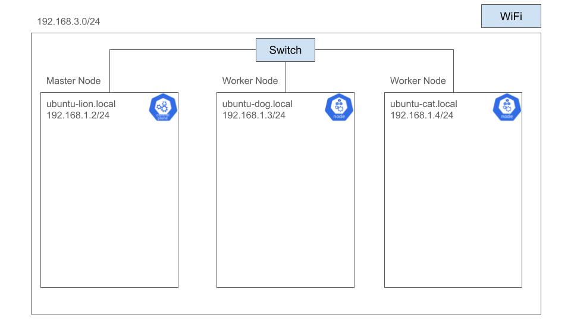

# My k8s Cluster App
I create my k8s cluster with 3 mini PCs for my study.
This repositry is record for my k8s study.

# My k8s Cluster Structure
My k8s cluster consists of 3 PCs and a switch. 3 PCs are connected with switch physically. 3PC is connected to internet by WiFi. I created k8s Cluster by [kubeadm command](https://kubernetes.io/docs/reference/setup-tools/kubeadm/). 1 PC(node) is master node. 2 PCs is worker node. I deployed a lot of application on this Cluster. I want to improve this cluster even more.

# Implementation Features
- GitOps
I impremented GitOps by [ArgoCD](https://argo-cd.readthedocs.io/en/stable/). 
ArgoCD monitors the source code so when source code is new, it is reflected in the cluster.

- CI
I impremented CI by GitHub Actions. I check yaml file structure and freshness of source code.

# Application on k8s cluster
- [Wekan](https://wekan.github.io/)

    This is kanban management tool.

- [k8s dashboard](https://kubernetes.io/docs/tasks/access-application-cluster/web-ui-dashboard/)
    
    This is k8s cluster monitor tool.

- [ArgoCD](https://argo-cd.readthedocs.io/en/stable/)

    This is GitOps tool.

- room monitor app

    This is monitoring tool of my house. I collected my house infomation(ex. temperature, humidity) by raspberry pi. I created web ui.

# Features I want to introduce

- Privete Docker Registry

    At present, I put my image on Docker Hub. I can't use private registry of Docker Hub by Free plan. So I want to create Privete Docker Registry on local PC or k8s cluster.